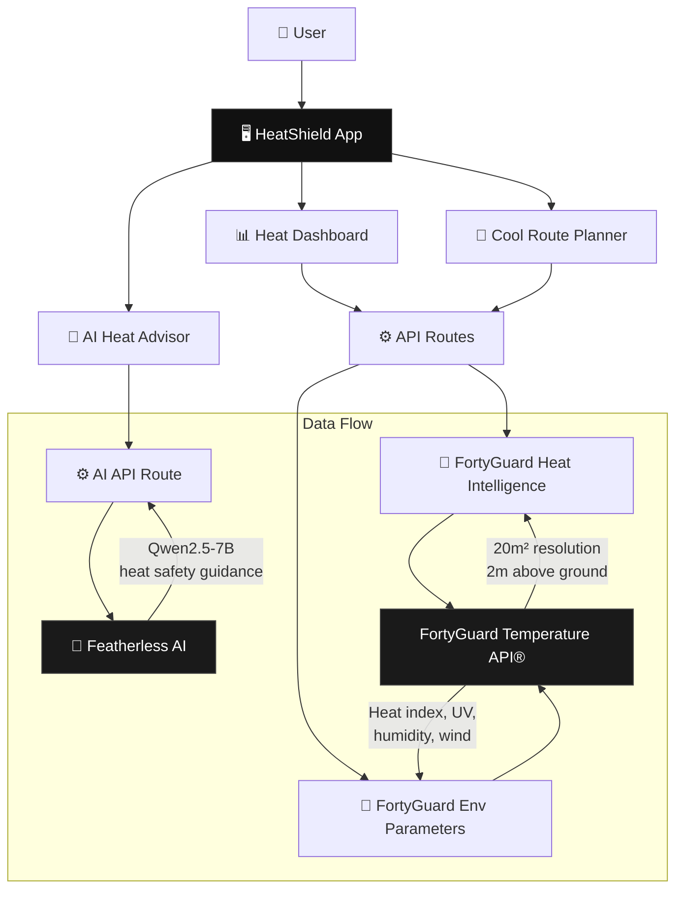
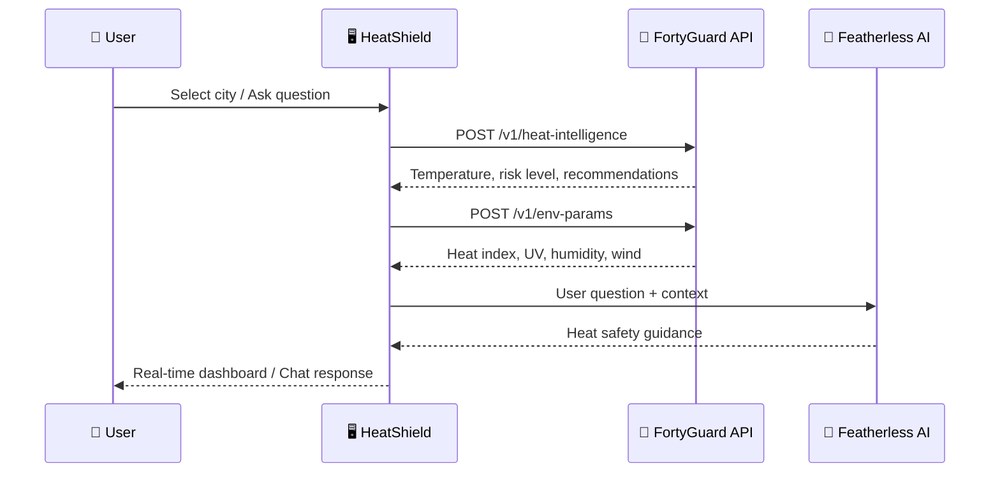

<div align="center">
  
  <h1>HeatShield</h1>
  <p><strong>AI-Powered Urban Heat Defense Platform</strong></p>
  <p><em>See heat. Stop heat. Save cities.</em></p>
  <br />
  <a href="https://heatshield.sithunyein.com">🌐 Live Demo</a> ·
  <a href="https://www.fortyguard.com/hackathon26">🏆 FortyGuard Hackathon'26</a> ·
  <a href="https://docs-api.fortyguard.com">📡 API Docs</a> ·
  <a href="#getting-started">🚀 Getting Started</a>
</div>

---

## 🛡️ The Problem

Urban heat is the **deadliest weather hazard** in the United States, killing more people than hurricanes, tornadoes, and floods combined. By 2050, **3.5 billion people** will live in extreme heat zones. Yet cities have no real-time, hyperlocal temperature intelligence to act on.

**Current tools fail because:**

- 🌡️ **Weather stations are too sparse** — one sensor per 10+ km² misses street-level heat islands
- 🏙️ **Urban planners fly blind** — no 20m² resolution data to identify hotspots before people die
- 🚶 **Pedestrians have no guidance** — no route optimization to avoid peak heat exposure
- 🚨 **Emergency response is reactive** — no predictive risk scoring to pre-deploy resources

**HeatShield solves this.** We provide real-time, hyperlocal temperature intelligence at 20m² resolution — the most granular urban heat data available — powered by FortyGuard's NVIDIA-recognized Temperature API.

---

## 🏗️ Architecture



### How It Works



---

## 🚀 Features

| Feature | Description | Status |
|---------|-------------|--------|
| **🗺️ Live Heat Maps** | Interactive Leaflet map with thermal visualization at 20m² resolution | ✅ Live |
| **🛡️ Risk Scoring** | AI-driven composite risk score (0-100) from temperature, humidity, UV, wind | ✅ Live |
| **🚶 Cool Routes** | Route planner with shade analysis and heat savings calculations | ✅ Live |
| **🤖 AI Heat Advisor** | Chat-based assistant powered by Featherless AI (Qwen2.5-7B) | ✅ Live |
| **📊 Environmental Parameters** | Heat index, apparent temperature, wet bulb temperature, UV index | ✅ Live |
| **🌐 Real-time Data** | Live FortyGuard API integration with async polling | ✅ Live |

---

## 📁 Project Structure

```
heatshield/
├── public/
│   ├── heatshield-logo.png          # App logo
│   └── heatshield-logo.svg          # SVG version
├── src/
│   ├── app/                          # Next.js App Router
│   │   ├── layout.tsx               # Root layout (dark mode, favicon)
│   │   ├── page.tsx                 # Landing page (video hero, FAQ, footer)
│   │   ├── globals.css              # Design system (heat gradients, glass effects)
│   │   ├── dashboard/
│   │   │   └── page.tsx            # Main heat dashboard + Leaflet map
│   │   ├── advisor/
│   │   │   └── page.tsx            # AI Heat Advisor chat interface
│   │   ├── routes/
│   │   │   └── page.tsx            # Cool Route Planner
│   │   └── api/
│   │       ├── intelligence/
│   │       │   └── route.ts        # FortyGuard /v1/heat-intelligence proxy
│   │       ├── env-params/
│   │       │   └── route.ts        # FortyGuard /v1/env-params proxy
│   │       └── advisor/
│   │           └── route.ts        # Featherless AI chat proxy
│   ├── components/
│   │   ├── Navbar.tsx               # Responsive nav with mobile hamburger menu
│   │   ├── HeatMap.tsx              # Leaflet map with thermal markers
│   │   ├── TemperatureGauge.tsx     # Animated temperature display
│   │   ├── RiskCard.tsx             # City risk score card
│   │   └── CitySelector.tsx         # City search dropdown
│   └── lib/
│       ├── fortyguard.ts            # FortyGuard API client (async submit/poll)
│       ├── ai.ts                    # Featherless AI client + local fallback
│       ├── types.ts                 # TypeScript types + preset cities
│       └── utils.ts                 # Formatting, colors, helpers
├── .env.example                     # Environment variable template
├── .gitignore                       # Git ignore rules
├── package.json                     # Dependencies
├── README.md                        # This file
└── tsconfig.json                    # TypeScript config
```

---

## 🛠️ Tech Stack

| Layer | Technology | Purpose |
|-------|-----------|---------|
| **Framework** | Next.js 15 (App Router) | Server-side rendering, API routes |
| **Language** | TypeScript | Type safety, developer experience |
| **Styling** | Tailwind CSS | Utility-first design system |
| **Map** | Leaflet + OpenStreetMap | Interactive heat map visualization |
| **AI** | Featherless AI (Qwen2.5-7B) | Heat safety chat advisor |
| **API** | FortyGuard Temperature API® | Real-time urban temperature data |
| **Deployment** | Vercel | Edge functions, global CDN |
| **Icons** | Lucide React | Minimal geometric icons |

---

## 📡 API Endpoints

| Endpoint | Method | Description |
|----------|--------|-------------|
| `/api/intelligence` | POST | Get heat intelligence for coordinates |
| `/api/env-params` | POST | Get environmental parameters |
| `/api/advisor` | POST | Chat with AI heat advisor |

### Example Request

```bash
curl -X POST https://heatshield.sithunyein.com/api/intelligence \
  -H "Content-Type: application/json" \
  -d '{"latitude": 33.45, "longitude": -112.07}'
```

### Example Response

```json
{
  "result": {
    "temperature": {
      "current": 112,
      "feels_like": 118,
      "unit": "°F"
    },
    "risk_level": "EXTREME",
    "risk_score": 92,
    "recommendations": [
      "Avoid outdoor activities between 10 AM - 4 PM",
      "Stay hydrated — drink water every 15 minutes",
      "Seek air-conditioned environments"
    ]
  }
}
```

---

## 🚀 Getting Started

### Prerequisites

- **Node.js** 18+ (recommended: 20+)
- **npm** or **yarn**
- **FortyGuard API Key** — [Get one here](https://www.fortyguard.com/hackathon26)
- **Featherless AI Key** — [Get one here](https://featherless.ai)

### Installation

```bash
# Clone the repository
git clone https://github.com/thesithunyein/heatshield.git
cd heatshield

# Install dependencies
npm install

# Set up environment variables
cp .env.example .env.local
```

### Environment Variables

```env
# Required — FortyGuard Temperature API
FORTYGUARD_API_KEY=your_fortyguard_api_key

# Required — Featherless AI for Heat Advisor
FEATHERLESS_API_KEY=your_featherless_api_key
```

### Development

```bash
npm run dev
# → http://localhost:3000
```

### Production Build

```bash
npm run build
npm start
```

### Deployment

```bash
# Deploy to Vercel
vercel --prod
```

---

## 🏆 Hackathon'26

HeatShield was built for **FortyGuard Hackathon 2026** — Track 01: Resilient Cities & Infrastructure.

| Judging Criterion | How HeatShield Addresses It |
|-------------------|----------------------------|
| **Impact (40%)** | Saves lives through real-time heat risk intelligence |
| **Technical Execution (35%)** | Full-stack TypeScript, async API polling, Leaflet maps, AI integration |
| **Innovation (15%)** | Hyperlocal 20m² resolution + AI-powered route optimization |
| **Communication (10%)** | Clean UI, clear data visualization, intuitive UX |

---

## 🔒 Security

### API Key Protection

- All FortyGuard API calls are made server-side through Next.js API routes
- API keys are stored in environment variables, never exposed to the client
- Rate limiting is applied to prevent abuse

### Reporting Vulnerabilities

If you discover a security vulnerability, please **do not** open a public GitHub issue. Instead, email:

**sithunyein.mailto@gmail.com**

We will respond within 48 hours and work with you to address the issue.

---

## 📄 License

This project is licensed under the **MIT License** — see the [LICENSE](LICENSE) file for details.

```
MIT License

Copyright (c) 2026 Sithu Nyein

Permission is hereby granted, free of charge, to any person obtaining a copy
of this software and associated documentation files (the "Software"), to deal
in the Software without restriction, including without limitation the rights
to use, copy, modify, merge, publish, distribute, sublicense, and/or sell
copies of the Software, and to permit persons to whom the Software is
furnished to do so, subject to the following conditions:

The above copyright notice and this permission notice shall be included in all
copies or substantial portions of the Software.

THE SOFTWARE IS PROVIDED "AS IS", WITHOUT WARRANTY OF ANY KIND, EXPRESS OR
IMPLIED, INCLUDING BUT NOT LIMITED TO THE WARRANTIES OF MERCHANTABILITY,
FITNESS FOR A PARTICULAR PURPOSE AND NONINFRINGEMENT. IN NO EVENT SHALL THE
AUTHORS OR COPYRIGHT HOLDERS BE LIABLE FOR ANY CLAIM, DAMAGES OR OTHER
LIABILITY, WHETHER IN AN ACTION OF CONTRACT, TORT OR OTHERWISE, ARISING FROM,
OUT OF OR IN CONNECTION WITH THE SOFTWARE OR THE USE OR OTHER DEALINGS IN THE
SOFTWARE.
```

---

## 🤝 Code of Conduct

### Our Pledge

We are committed to making participation in HeatShield a harassment-free experience for everyone, regardless of age, body size, disability, ethnicity, gender identity and expression, level of experience, nationality, personal appearance, race, religion, or sexual identity and orientation.

### Our Standards

**Positive behavior includes:**
- Using welcoming and inclusive language
- Being respectful of differing viewpoints and experiences
- Gracefully accepting constructive criticism
- Focusing on what is best for the community
- Showing empathy towards other community members

**Unacceptable behavior includes:**
- Trolling, insulting/derogatory comments, and personal or political attacks
- Public or private harassment
- Publishing others' private information without explicit permission
- Other conduct which could reasonably be considered inappropriate in a professional setting

### Enforcement

Instances of abusive, harassing, or otherwise unacceptable behavior may be reported to the project maintainer at **sithunyein.mailto@gmail.com**. All complaints will be reviewed and investigated and will result in a response that is deemed necessary and appropriate to the circumstances.

---

## 🙏 Acknowledgments

- **[FortyGuard](https://www.fortyguard.com)** — Temperature API and Hackathon'26
- **[Featherless AI](https://featherless.ai)** — AI inference for Heat Advisor
- **[Leaflet](https://leafletjs.com)** — Interactive map visualization
- **[Next.js](https://nextjs.org)** — React framework
- **[Vercel](https://vercel.com)** — Deployment platform

---

<div align="center">
  
  <p><strong>Built for FortyGuard Hackathon'26</strong></p>
  <p><em>See heat. Stop heat. Save cities.</em></p>
  <br />
  <a href="https://heatshield.sithunyein.com">🌐 Live Demo</a> ·
  <a href="https://github.com/thesithunyein/heatshield">📦 GitHub</a> ·
  <a href="https://docs-api.fortyguard.com">📡 API Docs</a>
</div>
