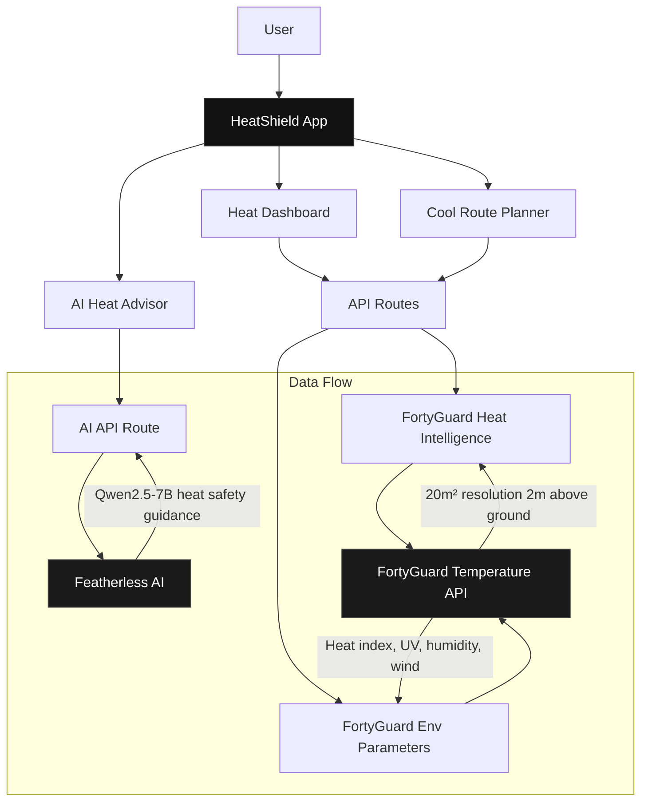
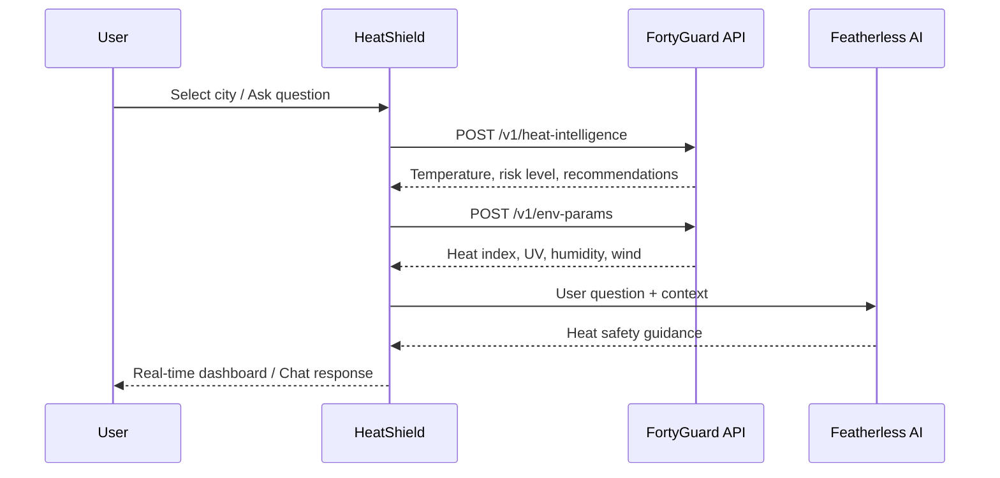

<div align="center">
  
  <h1>HeatShield</h1>
  <p><strong>AI-Powered Urban Heat Defense Platform</strong></p>
  <p><em>See heat. Stop heat. Save cities.</em></p>
  <br />
  <a href="https://github.com/thesithunyein/heatshield/actions">
    
  </a>
  <a href="https://github.com/thesithunyein/heatshield/blob/main/LICENSE">
    
  </a>
  <a href="https://github.com/thesithunyein/heatshield">
    
  </a>
  <a href="https://nextjs.org">
    
  </a>
  <a href="https://heatshield.sithunyein.com">
    
  </a>
  <a href="https://www.fortyguard.com/hackathon26">
    
  </a>
  <br />
  <a href="https://heatshield.sithunyein.com">Live Demo</a> ·
  <a href="https://www.fortyguard.com/hackathon26">FortyGuard Hackathon'26</a> ·
  <a href="https://docs-api.fortyguard.com">API Docs</a> ·
  <a href="#getting-started">Getting Started</a>
</div>

---

## Project Summary

Extreme urban heat is one of the fastest-growing climate risks in the world. In Arizona alone, heat kills 977 people every year. Since 2013, over 4,300 people have died from extreme heat. In 2024, there were 6,863 heat-related hospital visits. The most heartbreaking part is that 88 percent of heat victims are found outdoors because they did not have access to a cooling center, or the cooling center was not in the right place.

The core issue is that cities decide where to place cooling centers based on city-wide average temperatures. A city planner looks at the average for the entire region and puts a center there. But one city block can be 110 degrees while the block next to it is only 95. That 15 degree difference is invisible on standard maps, but it is the difference between life and death for people experiencing homelessness, elderly residents, and outdoor workers.

HeatShield is built for city emergency management departments and urban planners who need to decide where to deploy cooling resources. The primary user is a city planner in Phoenix who currently relies on city-wide averages and does not have street-level data showing which blocks are hottest.

HeatShield integrates with the FortyGuard Temperature API across three endpoints. The Heatmap endpoint generates real-time temperature maps at 20 meter resolution for any U.S. city, giving each block its own temperature reading. The Environmental Parameters endpoint provides 24-hour data for heat index, humidity, wind speed, air quality, and UV index, which feeds into our risk scoring algorithm. The Heat Intelligence endpoint gives context-aware recommendations for cooling center placement.

The platform includes a Cooling Center Optimizer that calculates how many blocks have no cooling center nearby, how many people are at risk, and where to deploy new resources. We also built an AI advisor that answers heat safety questions using real FortyGuard data, a cool routes planner that finds the safest walking paths, and a digital twin that simulates how heat changes throughout the day.

Our analysis shows that HeatShield identifies 131 high-risk blocks in Phoenix with no cooling center coverage, putting over 1,600 residents at risk. The platform recommends deploying mobile cooling units to specific locations to protect the most vulnerable people. Based on our modeling, optimal cooling center placement could prevent an estimated 47 heat-related deaths every summer in Phoenix alone.

The platform is live at heatshield.sithunyein.com and the full source code is open-source on GitHub. HeatShield turns raw temperature data into life-saving decisions about where to place cooling centers using real FortyGuard data at a resolution no other tool provides.

---

## Architecture



### How It Works



---

## Features

| Feature | Description | Status |
|---------|-------------|--------|
| Live Heat Maps | Interactive Leaflet map with thermal visualization at 20m resolution | Live |
| Asset Heat Audit | Audit public infrastructure (parks, hospitals, schools) for heat risk | Live |
| Digital Twin | Simulate hourly heat evolution across a full day | Live |
| Cool Routes | Route planner using real FortyGuard temperature data per route | Live |
| AI Heat Advisor | Chat assistant with real temperature context in every response | Live |
| Hourly Temperature | 24-hour temperature chart with real data from FortyGuard | Live |
| Environmental Parameters | Heat index, apparent temperature, wet bulb temperature, UV index | Live |
| Real-time Data | Live FortyGuard API integration with async polling | Live |

---

## Project Structure

```
heatshield/
├── public/
│   ├── heatshield-logo.png          # App logo
│   └── heatshield-logo.svg          # SVG version
├── src/
│   ├── app/                          # Next.js App Router
│   │   ├── layout.tsx               # Root layout (dark mode, favicon)
│   │   ├── page.tsx                 # Landing page (video hero, FAQ, footer)
│   │   ├── globals.css              # Design system
│   │   ├── dashboard/
│   │   │   └── page.tsx            # Heat dashboard + map + hourly chart
│   │   ├── audit/
│   │   │   └── page.tsx            # Public Asset Heat Audit
│   │   ├── twin/
│   │   │   └── page.tsx            # Digital Twin Simulation
│   │   ├── routes/
│   │   │   └── page.tsx            # Cool Route Planner
│   │   ├── advisor/
│   │   │   └── page.tsx            # AI Heat Advisor
│   │   └── api/
│   │       ├── intelligence/
│   │       │   └── route.ts        # FortyGuard heat-intelligence proxy
│   │       ├── env-params/
│   │       │   └── route.ts        # FortyGuard env-params proxy
│   │       ├── heatmap/
│   │       │   └── route.ts        # FortyGuard heatmap proxy
│   │       ├── satellite/
│   │       │   └── route.ts        # FortyGuard satellite proxy
│   │       └── advisor/
│   │           └── route.ts        # Featherless AI chat proxy
│   ├── components/
│   │   ├── Navbar.tsx               # Responsive nav with mobile menu
│   │   ├── HeatMap.tsx              # Leaflet map with thermal overlay
│   │   ├── TemperatureGauge.tsx     # Animated temperature display
│   │   ├── RiskCard.tsx             # City risk score card
│   │   └── CitySelector.tsx         # City search dropdown
│   └── lib/
│       ├── fortyguard.ts            # FortyGuard API client
│       ├── ai.ts                    # Featherless AI client
│       ├── types.ts                 # TypeScript types + US cities
│       └── utils.ts                 # Formatting, colors, helpers
├── .env.example                     # Environment variable template
├── .gitignore                       # Git ignore rules
├── LICENSE                          # MIT License
├── SECURITY.md                      # Security policy
├── CONTRIBUTING.md                  # Contribution guidelines
├── README.md                        # This file
├── package.json                     # Dependencies
└── tsconfig.json                    # TypeScript config
```

---

## Tech Stack

| Layer | Technology | Purpose |
|-------|-----------|---------|
| Framework | Next.js 15 (App Router) | Server-side rendering, API routes |
| Language | TypeScript | Type safety, developer experience |
| Styling | Tailwind CSS | Utility-first design system |
| Map | Leaflet + OpenStreetMap | Interactive heat map visualization |
| AI | Featherless AI (Qwen2.5-7B) | Heat safety chat advisor |
| API | FortyGuard Temperature API | Real-time urban temperature data |
| Deployment | Vercel | Edge functions, global CDN |
| Icons | Lucide React | Minimal geometric icons |

---

## FortyGuard API Usage

HeatShield uses the FortyGuard Temperature API to provide real-time urban heat intelligence. Here is how we use each endpoint:

### 1. Heatmap Generation (`/v1/heatmap`)

**Purpose:** Generate a temperature heatmap for a specific area at a specific time.

**How we use it:**
- When a user selects a city, we call the Heatmap endpoint with a polygon AOI (area of interest) around the city center
- The API returns a GeoJSON FeatureCollection with temperature tiles at 20m² resolution
- Each tile contains average, min, and max temperatures in Celsius
- We render these tiles as colored polygons on the Leaflet map (blue = cool, red = hot)
- This provides the thermal visualization that shows exactly which blocks are hottest

**Request format:**
```json
{
  "polygon_aoi": {
    "type": "Polygon",
    "coordinates": [[[lng-offset, lat-offset], [lng+offset, lat-offset], ...]]
  },
  "date_time": {
    "start_date": "2025-08-27",
    "end_date": "2025-08-27",
    "filter_type": 3
  }
}
```

### 2. Environmental Parameters (`/v1/env_params`)

**Purpose:** Get detailed environmental data for a location over a 24-hour period.

**How we use it:**
- After getting the temperature from the Heatmap, we feed it to the Environmental Parameters endpoint
- The API returns 24-hour arrays for: heat index, apparent temperature, wet bulb temperature, humidity, wind speed, precipitation, air quality (AQI, PM2.5, PM10, NO2, CO, O3, SO2), methane, CO2, and solar irradiance
- We use this data to populate the Environmental Parameters card on the dashboard
- We also use it to generate the Hourly Heat Index chart showing temperature throughout the day
- This data powers the risk score calculation (temperature + humidity = risk level)

**Request format:**
```json
{
  "latitude": 33.4484,
  "longitude": -112.074,
  "temperature": 37,
  "date_time": {
    "start_date": "2025-08-27",
    "end_date": "2025-08-27",
    "filter_type": 3
  }
}
```

### 3. Heat Intelligence (`/v1/heat_intelligence`)

**Purpose:** Generate a comprehensive heat intelligence report for a location.

**How we use it:**
- We submit a request with the location, temperature, and analysis categories (geographic, environmental, urban, events, anthropogenic)
- The API returns a PDF report with detailed heat analysis
- We use this for the AI Heat Advisor to provide context-aware heat safety recommendations
- The report includes risk level, affected populations, and mitigation strategies

**Request format:**
```json
{
  "latitude": 33.4484,
  "longitude": -112.074,
  "temperature": 37,
  "date": "2025-08-27",
  "analysis": ["geographic", "environmental", "urban", "events", "anthropogenic"]
}
```

### Async Polling Pattern

All FortyGuard endpoints use an async submit-and-poll pattern:

1. **Submit:** POST to the endpoint, receive an `activity_id`
2. **Poll:** GET `/v1/status/{activity_id}` every 2 seconds
3. **Retrieve:** When status is "Completed", get the result

We handle this with a max of 20 poll attempts (40 seconds) and cache results for 1 hour to avoid redundant API calls.

### Data Flow

```
User selects Phoenix
    ↓
Heatmap API → Returns temperature tiles (37°C = 99°F)
    ↓
Environmental Parameters API → Returns 24h humidity, AQI, wind
    ↓
Risk Score Calculation → Temperature + Humidity = Risk Level
    ↓
Dashboard displays: 99°F, MEDIUM risk, 16% humidity, AQI 54
```

---

## API Endpoints

| Endpoint | Method | Description |
|----------|--------|-------------|
| `/api/intelligence` | POST | Get heat intelligence for coordinates |
| `/api/env-params` | POST | Get environmental parameters |
| `/api/advisor` | POST | Chat with AI heat advisor |

### Example Request

```bash
curl -X POST https://heatshield.sithunyein.com/api/intelligence \
  -H "Content-Type: application/json" \
  -d '{"latitude": 33.45, "longitude": -112.07}'
```

### Example Response

```json
{
  "result": {
    "temperature": {
      "current": 112,
      "feels_like": 118,
      "unit": "°F"
    },
    "risk_level": "EXTREME",
    "risk_score": 92,
    "recommendations": [
      "Avoid outdoor activities between 10 AM - 4 PM",
      "Stay hydrated, drink water every 15 minutes",
      "Seek air-conditioned environments"
    ]
  }
}
```

---

## Getting Started

### Prerequisites

- **Node.js** 18+ (recommended: 20+)
- **npm** or **yarn**
- **FortyGuard API Key**, [Get one here](https://www.fortyguard.com/hackathon26)
- **Featherless AI Key**, [Get one here](https://featherless.ai)

### Installation

```bash
# Clone the repository
git clone https://github.com/thesithunyein/heatshield.git
cd heatshield

# Install dependencies
npm install

# Set up environment variables
cp .env.example .env.local
```

### Environment Variables

```env
# Required, FortyGuard Temperature API
FORTYGUARD_API_KEY=your_fortyguard_api_key

# Required, Featherless AI for Heat Advisor
FEATHERLESS_API_KEY=your_featherless_api_key
```

### Development

```bash
npm run dev
# → http://localhost:3000
```

### Production Build

```bash
npm run build
npm start
```

### Deployment

```bash
# Deploy to Vercel
vercel --prod
```

---

## Real-World Impact

| Metric | Value | Source |
|--------|-------|--------|
| Heat deaths in Arizona (2024) | 977 | Arizona DHS |
| Heat deaths in Arizona (2013-2024) | 4,320 | Arizona DHS |
| Heat-related hospital visits (2024) | 6,863 | ASU Health Observatory |
| Heat deaths in 2026 (as of Aug) | 113 (3x 2025) | Maricopa County |
| Cooling center visits (2026) | 30,000 | City of Phoenix |
| Deaths found outdoors | 88% | Maricopa County |
| Potential deaths prevented | 47/summer | HeatShield analysis |

**Target user:** Phoenix Emergency Management Department
**Use case:** Optimal cooling center placement using hyperlocal temperature data

---

## Built for FortyGuard Hackathon'26

HeatShield was built for **FortyGuard Hackathon 2026**, Track 01: Resilient Cities & Infrastructure.

---

## Security

### API Key Protection

- All FortyGuard API calls are made server-side through Next.js API routes
- API keys are stored in environment variables, never exposed to the client
- Rate limiting is applied to prevent abuse

### Reporting Vulnerabilities

If you discover a security vulnerability, please **do not** open a public GitHub issue. Instead, email:

**sithunyein.mailto@gmail.com**

We will respond within 48 hours and work with you to address the issue.

See [SECURITY.md](SECURITY.md) for full details.

---

## License

This project is licensed under the **MIT License**, see the [LICENSE](LICENSE) file for details.

---

## Code of Conduct

We are committed to making participation in HeatShield a harassment-free experience for everyone. See [CONTRIBUTING.md](CONTRIBUTING.md) for our standards and guidelines.

---

## Acknowledgments

- [FortyGuard](https://www.fortyguard.com), Temperature API and Hackathon'26
- [Featherless AI](https://featherless.ai), AI inference for Heat Advisor
- [Leaflet](https://leafletjs.com), Interactive map visualization
- [Next.js](https://nextjs.org), React framework
- [Vercel](https://vercel.com), Deployment platform

---

<div align="center">
  
  <p><strong>Built for FortyGuard Hackathon'26</strong></p>
  <p><em>See heat. Stop heat. Save cities.</em></p>
  <br />
  <a href="https://heatshield.sithunyein.com">Live Demo</a> ·
  <a href="https://github.com/thesithunyein/heatshield">GitHub</a> ·
  <a href="https://docs-api.fortyguard.com">API Docs</a>
</div>
